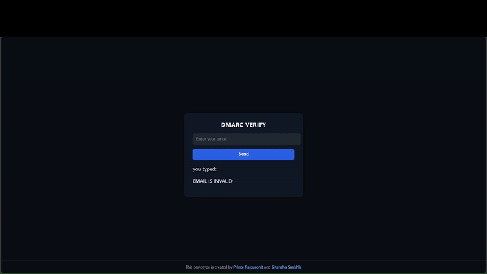

<h1 align="center">🛡️ DMARC – Frontend</h1> 
 A clean and minimal React interface for analyzing DMARC configuration of email domains.  Built as a security-focused frontend project to practice real-world API integration and email security tooling. 
 
 

<h3 align="center">🎥 Project Demo</h3>

  

Live demo of the DMARC Sentinel frontend showing email input, API request and real-time DMARC result rendering.

 

<h3>⚡ Overview</h3> 
 This project provides a web interface where a user can enter an email address and instantly receive information about the domain’s DMARC configuration. 
 
 The application communicates with a backend API, receives the DMARC analysis result and presents it in a structured and readable report panel. 
 
 <h3>🔍 What the frontend does</h3> <ul> <li>Accepts an email address from the user</li> <li>Performs client-side validation</li> <li>Sends a POST request to the verification API</li> <li>Receives and renders DMARC analysis results</li> <li>Displays DMARC record, presence status and policy type</li> </ul> 
 <h3>🧠 Why this project</h3> 
 DMARC is a critical security mechanism used to protect domains against spoofing and phishing attacks. This frontend was built to better understand how email authentication data can be visualized and consumed in real security tools. 
 
 <h3>🛠️ Frontend implementation</h3> <ul> <li>Built using React (Create React App)</li> <li>Uses modern React hooks (<code>useState</code>, <code>useEffect</code>)</li> <li>Implements real API integration using the Fetch API</li> <li>Handles cross-origin API communication (CORS-aware frontend)</li> <li>Custom UI built with plain CSS (no UI frameworks)</li> </ul> 
 <h3>🔌 API integration</h3> 
 The frontend connects to the following endpoint: 
 <pre><code>POST http://localhost:8081/verify</code></pre> 
Request body:
 <pre><code>{ "email": "user@example.com" }</code></pre> 
 <h3>👤 Author</h3> 
 Prince Rajpurohit  BCA Student | Cybersecurity & Ethical Hacking Enthusiast 
 
 
 Built as a hands-on learning project focused on security tooling and frontend–backend integration. 

